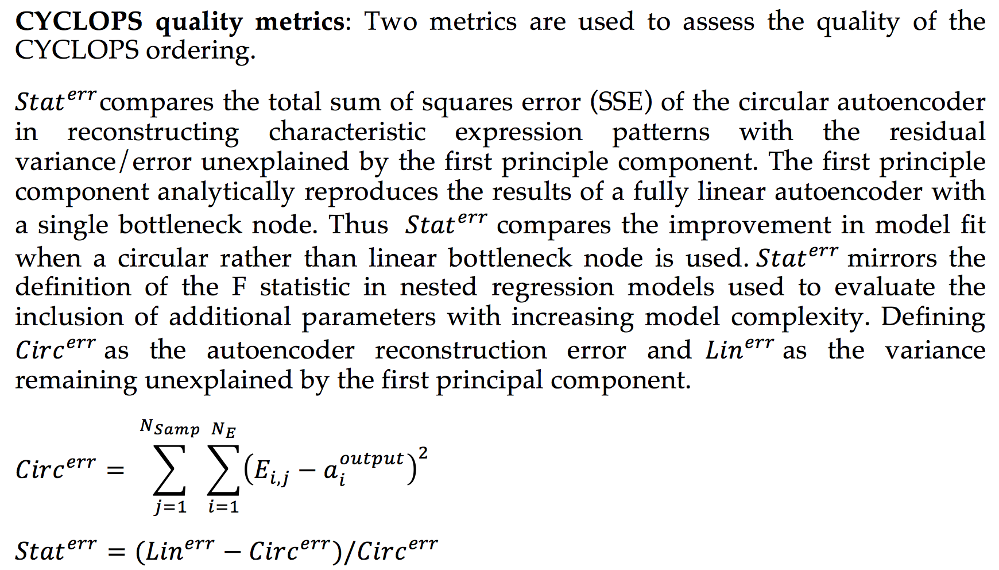
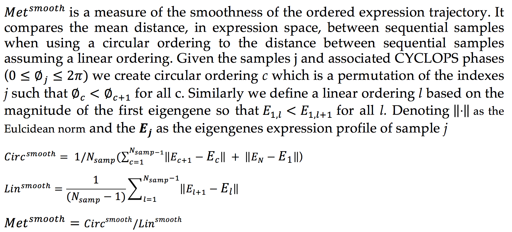
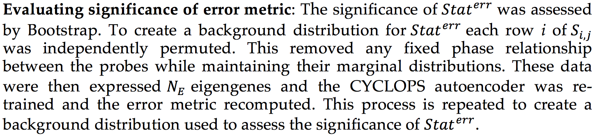
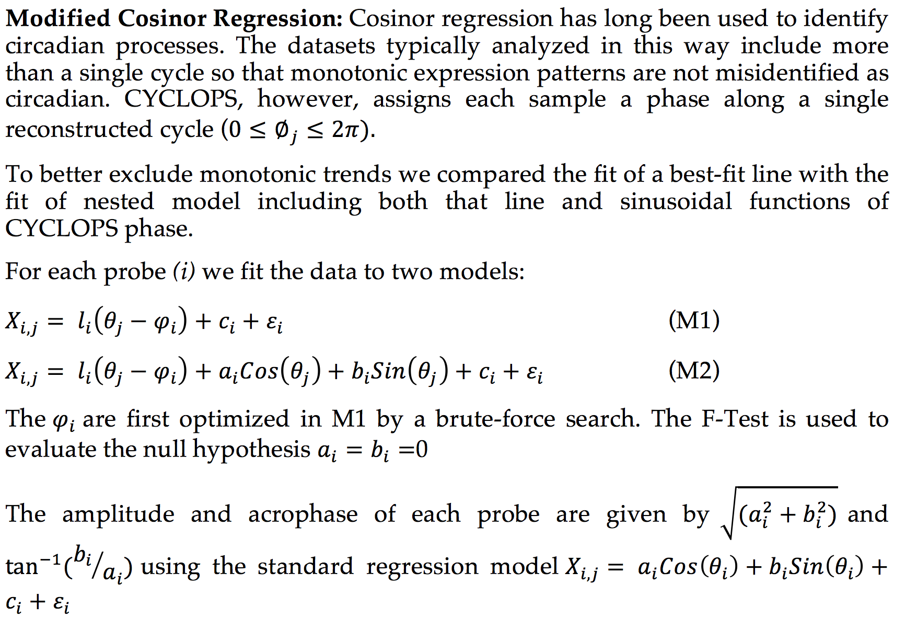

# Introduction about CYCLOPS

## General description

CYCLOPS (Cyclic Ordering by Periodic Structure) is a tool designed to reconstruct the temporal ordering of high dimensional that is generated by a common periodic process.

Descriptions of the CYCLOPS approach can be found online at [PNAS](http://www.pnas.org/content/early/2017/04/19/1619320114.full).

* The CYCLOPS scripts are in ‘PNAS_CYCLOPS_PROGRAM_SCRIPTS_REVISION_UPLOAD’, and the example scripts are in  ’PNAS_CYCLOPS_APPLICATIONS_SCRIPTS_REVISION_UPLOAD’.

* This README file is NOT a comprehensive guide to using CYCLOPS. Please see the example scripts for more direction. If you have further troubles/questions – please email.

CYCLOPS is based on a circular node autoencoder (see the work of Kirby and Miranda). 

Most backpropogation scripts are written under the assumption that all derivatives can be computed from the inputs to a given node. In a circular node device this is not the case. It is for this reason that generic NN programs may not be suited for this problem.

The infrastructure of CYLCOPS was designed so that it could eventually handle various network structures and activation functions. For now, however, CYCLOPS is running with linear neurons projecting onto a singular circular node.  

Non Linear PCA tools in matlab have implemented circular node autoencoders (see the work of Matthias Scholz and also the work of William W. Hsieh). I have not had a Matlab license for a while! Earlier I was getting errors in the Scholz NLPCA output (when using a circular node) and could not track down the bug. That being said, for those with matlab, these are alternatives to consider.

## Important notes in using CYCLOPS

To run the CYCLOPS program you will need:

* A gene expression data set (each column is a different sample, each row is a different gene)

* A list of “seed genes” believed to be enriched for rhythmic expression and used to base orderings

There are several parameter used in the CYCLOPS ordering and should be set in the main program calling the various CYCLOPS routine.

* Frac_Var=0.85 # The Number of Dimensions of SVD retained is set to maintain this fraction of variance

* DFrac_Var=0.03 # The Number of Dimensions of SVD retained is set so that the incremental fraction of variance increases by at leas this much with each added dimension

* N_trials =40  # Number of random initial conditions to try for each optimization

* MaxSeeds = 10000  # Maximum number of seed genes accepted

* total_background_num=200 # Number of background runs for global background reference statistics (note that computing the background distribution and assessing significance is by far the most time consuming aspect. You may decided to hold on running background statistics until after you have explored CYCLOPS and the results)

* n_cores=5 # Number of machine cores (not really used right now –program is just –might need to adjust multicore stats routine)

	+ At present CYCLOPS is written to optimally run on a computer with 6 physical cores
	+ While there is a parameter describing the number of cores – this is presently not used
	+ If your computer has a different number of cores – you will (unfortunately) need to go through the code. We aim to correct this

Cleaning, normalization, and scaling of data performed before temporal reconstruction, as is a dimensional reduction scheme. All of these can have a marked effect on results. Much of data cleaning takes place within the ‘getseed’ function (an example function call is bellow)

```r
getseed(data::Array{Any,2},symbol_list,maxcv=.75,mincv=.07,minmean=500,blunt=.99)

```

The first argument is the full data matrix.
The second is the list of seed genes to be extracted to use in reconstruction.

However it is likely that some of these seed genes are likely poor candidates upon which to base reconstruction. The next arguments further constrain the list.
For example,  it makes no sense to base an ordering on a gene with no variation in expression.

The ‘mincv’ and ‘maxcv’ are minimum and maximum coefficient of variation (in expression) allowed for genes in the seed list. Genes with expression variation outside this bound are not used for the basis of CYCLOPS ordering.

Similarly genes must have a mean expression above the threshold ‘minmean’

Finally, extreme values are capped above/bellow the ‘blunt’ percentile. 

Data are then normalized as a percent dispersion from the mean.

Finally dimensional reduction is implemented by SVD.

Depending on your problem, different strategies may be more effective or appropriate.


## Mathematical introduction to CYCLOPS











## More information about CYCLOPS


Please see the files in ‘docs’ directory of this repository and read the paper published on [PNAS](http://www.pnas.org/content/early/2017/04/19/1619320114.full). 


